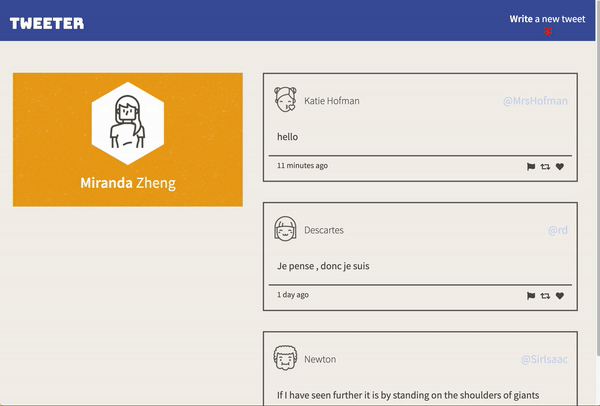

# Tweeter Project

Tweeter is a simple, single-page Twitter clone.

This repository is the starter code for the project: Students will fork and clone this repository, then build upon it to practice their HTML, CSS, JS, jQuery and AJAX front-end skills, and their Node, Express back-end skills.

## Final Product

Final Tweeter Project Home Page

## Dependencies

- Express
- Node 5.10.x or above
- body-parser
- chance

## Behaviour

- When the user hovers over a tweet, that tweet should display a box shadow.
- When the user hovers over an icon ("Flag", "Re-tweet" and "Like") the icon changes colour.
- When a user types into the Compose Tweet textarea, the Character Counter is updated to show how many characters a user may still type
- The Character Counter turns red when more than 140 characters have been typed into the Compose Tweet textarea
- When a user submits an invalid tweet (the tweet textarea is empty or contains more than 140 characters), an appropriate error message is displayed

- When a user submits a valid tweet, the list of tweets is refreshed (displaying the new tweet), the Compose Tweet textarea is cleared, and the Character Counter is reset (to 140)
- When a user clicks the Compose button in the Navigation Bar:

  1. if the Compose Tweet box is currently hidden, then it is shown, and the textarea inside it is auto-focused
  2. if the Compose Tweet box is currently showing, then it is hidden
  3. in either case, transitions between 'shown' and 'hidden' states should be animated

- When a user scrolls a second button appears in the lower right hand corner:
  if the user clicks this button they are brought back up to the top of the page

## Getting Started

1. [Create](https://docs.github.com/en/repositories/creating-and-managing-repositories/creating-a-repository-from-a-template) a new repository using this repository as a template.
2. Clone your repository onto your local device.
3. Install dependencies using the `npm install` command.
4. Start the web server using the `npm run local` command. The app will be served at <http://localhost:8080/>.
5. Go to <http://localhost:8080/> in your browser.
